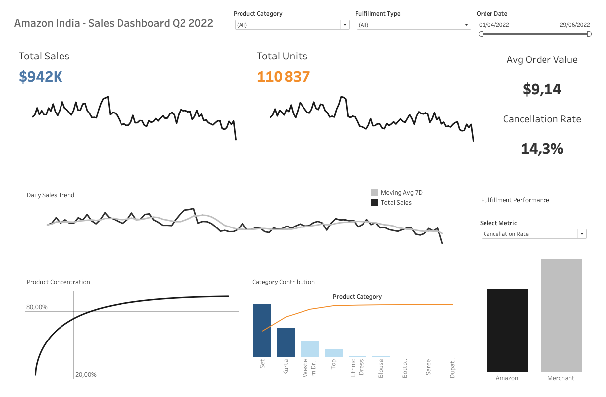

# SQL Data Analytics Project

## E-Commerce analysis (Amazon)

### Project objective :

Analyze e-commerce sales performance to identify key revenue drivers, operational inefficiencies and growth opportunities across products, categories and fulfillment methods.

This repository includes raw data ingestion, SQL-based ETL transformations, analytics views, and a Tableau dashboard for interactive exploration of:

- sales trends and seasonality
- product mix and category performance
- fulfillment channel efficiency
- order cancellations and their impact on revenue

### Tableau dashboard

The Tableau dashboard provides an interactive view of Amazon sales performance, with filters for time, category, product, and fulfillment method.

[Open the Tableau dashboard](https://public.tableau.com/app/profile/yoann.robert/viz/amazon_in_sales_dashboard/Amazon_Sales_Dashboard)

### License & attribution

This project uses data made available on [Kaggle](https://www.kaggle.com/datasets/thedevastator/unlock-profits-with-e-commerce-sales-data?resource=download) by ANil.
Original data source: data.world.
Used for educational and portfolio purposes only.
