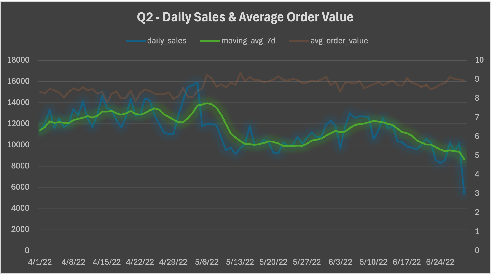
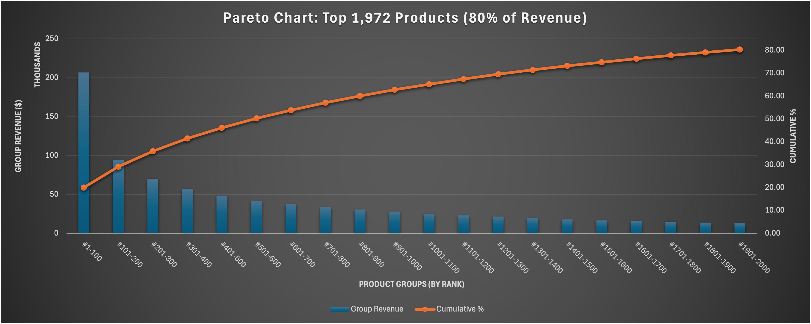

# Ecommerce Analysis Report

## 0. Dataset Overview

### 0.1. Overview KPIs

| measure_name       | measure_value |
| ------------------ | ------------- |
| Total Sales        | $941,786      |
| Total Quantity     | 110,837       |
| Avg Price Per Item | $8.50         |
| Total Orders       | 103,053       |
| Avg Item Per Order | 1.08          |
| Avg Order Amount   | $9.14         |
| Distinct Products  | 7,123         |
| Cancellation Rate  | 14%           |

## 1. Q2 Trend Analysis

The chart below shows daily sales with a 7-day moving average to highlight underlying trends:

### 1.1. Daily Sales Trend

- Sales slowly increased throughout April, reaching a peak at the end of the month
- Sales increased by 45% between April 29th and May 4th, peaking at $14,549
- Sales dropped below April's average right after the peak and stabilized around a $9,651 daily average through the end of Q2

### 1.2. Trend Drivers

- The increase in sales is primarily driven by higher order volume
- Average order value remains stable (~$8.7–$9.7)
- This indicates no significant pricing or basket size change

### 1.3 Monthly Summary

| month_name | total_sales | total_orders | total_quantity |
| ---------- | ----------- | ------------ | -------------- |
| April      | $345,203    | 39,132       | 42,096         |
| May        | $315,151    | 33,737       | 36,267         |
| June       | $281,432    | 30,184       | 32,474         |

- Sales declined month-over-month from April to June
- The consistent decline across all metrics suggests a demand-driven decrease rather than operational constraints

### 1.4. Sample Data (first 5 days)

| order_date | daily_sales | daily_quantity | daily_orders | avg_order_value | running_total | moving_avg_7d |
| ---------- | ----------- | -------------- | ------------ | --------------- | ------------- | ------------- |
| 2022-04-01 | 10259.80    | 1237           | 1236         | 8.98            | 10259.80      | 10259.80      |
| 2022-04-02 | 10672.41    | 1302           | 1299         | 8.80            | 20932.21      | 10466.11      |
| 2022-04-03 | 12171.64    | 1453           | 1450         | 9.08            | 33103.85      | 11034.62      |
| 2022-04-04 | 10706.71    | 1271           | 1267         | 8.97            | 43810.56      | 10952.64      |
| 2022-04-05 | 11574.95    | 1416           | 1408         | 8.86            | 55385.51      | 11077.10      |

### 1.5. Summary

Overall, the dataset shows a short-term growth phase followed by a steady decline, with no evidence of strong seasonality due to the limited time range.

## 2. Product Mix & Concentration

### 2.1. Concentration Overview

The chart below shows the Pareto distribution of the products grouped by ranking in blocks of 100 products each:

- The chart clearly shows the classic Pareto curve - steep decline in the bars from left to right, with the cumulative line gradually flattening as it approaches 80%
- 27% of the products (1,972 out of 7,123) represent 80% of the total revenue
- The first group alone (#1-100) contributes to 20% of the total revenue

Below is the Top 100 share :

| rank | product_sku       | product_revenue | cumulative_revenue | cumulative_share_pct |
| ---- | ----------------- | --------------- | ------------------ | -------------------- |
| 1    | J0230-SKD-M       | $6,334          | $6,334             | 0.67%                |
| 2    | JNE3797-KR-L      | $6,184          | $12,519            | 1.33%                |
| 3    | J0230-SKD-S       | $5,879          | $18,397            | 1.95%                |
| 4    | JNE3797-KR-M      | $5,303          | $23,700            | 2.52%                |
| 5    | JNE3797-KR-S      | $4,728          | $28,428            | 3.02%                |
| 6    | JNE3797-KR-XL     | $3,979          | $32,408            | 3.44%                |
| 7    | J0230-SKD-L       | $3,653          | $36,061            | 3.83%                |
| 8    | JNE3797-KR-XS     | $3,613          | $39,674            | 4.21%                |
| 9    | SET268-KR-NP-XL   | $3,414          | $43,088            | 4.58%                |
| 10   | JNE3797-KR-XXL    | $3,331          | $46,419            | 4.93%                |
| 11   | JNE3797-KR-XXXL   | $3,301          | $49,720            | 5.28%                |
| 12   | SET268-KR-NP-L    | $3,183          | $52,903            | 5.62%                |
| 13   | SET268-KR-NP-S    | $3,180          | $56,084            | 5.96%                |
| 14   | J0230-SKD-XL      | $3,078          | $59,162            | 6.28%                |
| 15   | SET183-KR-DH-M    | $2,857          | $62,019            | 6.59%                |
| 16   | J0230-SKD-XS      | $2,774          | $64,793            | 6.88%                |
| 17   | J0341-DR-M        | $2,670          | $67,463            | 7.16%                |
| 18   | J0341-DR-L        | $2,586          | $70,049            | 7.44%                |
| 19   | J0341-DR-S        | $2,445          | $72,494            | 7.70%                |
| 20   | SET278-KR-NP-M    | $2,431          | $74,925            | 7.96%                |
| 21   | JNE3405-KR-L      | $2,341          | $77,266            | 8.20%                |
| 22   | J0003-SET-S       | $2,303          | $79,569            | 8.45%                |
| 23   | J0341-DR-XXL      | $2,189          | $81,758            | 8.68%                |
| 24   | J0008-SKD-M       | $2,171          | $83,930            | 8.91%                |
| 25   | JNE3405-KR-S      | $2,045          | $85,975            | 9.13%                |
| 26   | J0003-SET-M       | $1,989          | $87,964            | 9.34%                |
| 27   | SET397-KR-NP -M   | $1,977          | $89,941            | 9.55%                |
| 28   | SET324-KR-NP-M    | $1,976          | $91,917            | 9.76%                |
| 29   | J0341-DR-XL       | $1,964          | $93,881            | 9.97%                |
| 30   | J0341-DR-XXXL     | $1,922          | $95,803            | 10.17%               |
| 31   | SET345-KR-NP-M    | $1,894          | $97,698            | 10.37%               |
| 32   | J0008-SKD-S       | $1,799          | $99,497            | 10.56%               |
| 33   | J0003-SET-XXXL    | $1,719          | $101,216           | 10.75%               |
| 34   | J0339-DR-XL       | $1,713          | $102,929           | 10.93%               |
| 35   | JNE3405-KR-M      | $1,713          | $104,642           | 11.11%               |
| 36   | J0003-SET-XS      | $1,712          | $106,354           | 11.29%               |
| 37   | J0008-SKD-L       | $1,706          | $108,060           | 11.47%               |
| 38   | SET268-KR-NP-XXL  | $1,664          | $109,724           | 11.65%               |
| 39   | SET324-KR-NP-L    | $1,650          | $111,374           | 11.83%               |
| 40   | J0008-SKD-XS      | $1,595          | $112,969           | 12.00%               |
| 41   | J0339-DR-M        | $1,576          | $114,545           | 12.16%               |
| 42   | J0335-DR-L        | $1,572          | $116,116           | 12.33%               |
| 43   | JNE3800-KR-L      | $1,560          | $117,677           | 12.50%               |
| 44   | SET268-KR-NP-XS   | $1,552          | $119,229           | 12.66%               |
| 45   | J0003-SET-XXL     | $1,480          | $120,709           | 12.82%               |
| 46   | J0230-SKD-XXL     | $1,479          | $122,188           | 12.97%               |
| 47   | SET345-KR-NP-L    | $1,451          | $123,639           | 13.13%               |
| 48   | SET397-KR-NP-S    | $1,405          | $125,044           | 13.28%               |
| 49   | SET110-KR-PP-M    | $1,388          | $126,433           | 13.42%               |
| 50   | SET291-KR-PP-M    | $1,388          | $127,820           | 13.57%               |
| 51   | JNE3801-KR-M      | $1,387          | $129,207           | 13.72%               |
| 52   | SET345-KR-NP-S    | $1,385          | $130,593           | 13.87%               |
| 53   | SET278-KR-NP-S    | $1,385          | $131,978           | 14.01%               |
| 54   | JNE3798-KR-XL     | $1,376          | $133,354           | 14.16%               |
| 55   | J0341-DR-XS       | $1,368          | $134,722           | 14.30%               |
| 56   | JNE3567-KR-M      | $1,368          | $136,089           | 14.45%               |
| 57   | JNE3399-KR-M      | $1,367          | $137,456           | 14.60%               |
| 58   | SET268-KR-NP-M    | $1,331          | $138,788           | 14.74%               |
| 59   | J0003-SET-XL      | $1,331          | $140,118           | 14.88%               |
| 60   | SET331-KR-NP-M    | $1,327          | $141,446           | 15.02%               |
| 61   | SET268-KR-NP-XXXL | $1,325          | $142,771           | 15.16%               |
| 62   | SET197-KR-NP-L    | $1,324          | $144,095           | 15.30%               |
| 63   | JNE3800-KR-M      | $1,309          | $145,404           | 15.44%               |
| 64   | SET345-KR-NP-XL   | $1,308          | $146,712           | 15.58%               |
| 65   | SET304-KR-DPT-XS  | $1,304          | $148,015           | 15.72%               |
| 66   | J0285-SKD-XL      | $1,301          | $149,316           | 15.85%               |
| 67   | JNE3797-KR-A-M    | $1,295          | $150,611           | 15.99%               |
| 68   | SET278-KR-NP-XL   | $1,268          | $151,880           | 16.13%               |
| 69   | SET278-KR-NP-L    | $1,264          | $153,144           | 16.26%               |
| 70   | J0339-DR-L        | $1,263          | $154,406           | 16.40%               |
| 71   | JNE3373-KR-XXXL   | $1,251          | $155,657           | 16.53%               |
| 72   | SET398-KR-PP-XXL  | $1,234          | $156,891           | 16.66%               |
| 73   | J0119-TP-XXXL     | $1,231          | $158,122           | 16.79%               |
| 74   | SET264-KR-NP-XL   | $1,229          | $159,351           | 16.92%               |
| 75   | J0119-TP-XL       | $1,210          | $160,561           | 17.05%               |
| 76   | JNE3368-KR-XXL    | $1,194          | $161,755           | 17.18%               |
| 77   | SET331-KR-NP-L    | $1,188          | $162,943           | 17.30%               |
| 78   | SET264-KR-NP-M    | $1,187          | $164,130           | 17.43%               |
| 79   | SET392-KR-NP-M    | $1,180          | $165,310           | 17.55%               |
| 80   | JNE3801-KR-XXL    | $1,178          | $166,488           | 17.68%               |
| 81   | J0339-DR-XXL      | $1,171          | $167,659           | 17.80%               |
| 82   | JNE3405-KR-XXXL   | $1,167          | $168,826           | 17.93%               |
| 83   | J0012-SKD-XL      | $1,167          | $169,993           | 18.05%               |
| 84   | SET324-KR-NP-S    | $1,166          | $171,158           | 18.17%               |
| 85   | JNE3801-KR-L      | $1,157          | $172,315           | 18.30%               |
| 86   | J0119-TP-XXL      | $1,127          | $173,442           | 18.42%               |
| 87   | SET324-KR-NP-XXL  | $1,100          | $174,542           | 18.53%               |
| 88   | SET110-KR-PP-S    | $1,098          | $175,640           | 18.65%               |
| 89   | JNE3291-KR-XL     | $1,097          | $176,736           | 18.77%               |
| 90   | SET187-KR-DH-XL   | $1,090          | $177,826           | 18.88%               |
| 91   | SET291-KR-PP-L    | $1,087          | $178,913           | 19.00%               |
| 92   | J0285-SKD-M       | $1,086          | $179,999           | 19.11%               |
| 93   | J0339-DR-S        | $1,085          | $181,084           | 19.23%               |
| 94   | J0008-SKD-XL      | $1,079          | $182,164           | 19.34%               |
| 95   | JNE3405-KR-XS     | $1,074          | $183,238           | 19.46%               |
| 96   | JNE3368-KR-XXXL   | $1,072          | $184,310           | 19.57%               |
| 97   | J0244-SKD-L       | $1,059          | $185,370           | 19.68%               |
| 98   | JNE3399-KR-XL     | $1,052          | $186,421           | 19.79%               |
| 99   | J0335-DR-XL       | $1,051          | $187,473           | 19.91%               |
| 100  | SET345-KR-NP-XXL  | $1,048          | $188,520           | 20.02%               |

### 2.2. Long Tail Contribution

| total_products | low_performers | low_performer_pct |
| -------------- | -------------- | ----------------- |
| 7,123          | 7,006          | 98.36%            |

- 98.36% of products individually contribute less than 0.1% of total revenue
- This indicates a fragmented catalog, where the majority of SKUs generate negligible revenue on their own
- While hte long tail is large in volume, its economie contribution is highly diluted accross throusands of low-performing products

This confirms a classic marketplace dynamic where a small amount of products drives performence, while the majority of the catalog exists as a long tail with minimal individual impact.

### 2.3. Stability of Demand Core

| current_month_name | overlap_count |
| ------------------ | ------------- |
| May                | 6             |
| June               | 11            |

- The Top 20 products show low stability between April and May (only 6 products retained), indicating a significant shift in demand
- Stability improves between May and June (11 products retained), suggesting partial consolidation of top-performing products
- This pattern aligns with the sales peak observed at the end of April, followed by a reorganization of demand in May

### 2.4. Churn in Top Products

| previous_month | churned_products |
| -------------- | ---------------- |
| 4              | 14               |
| 5              | 9                |
| 6              | 20               |

- The Top 20 composition shows high turnover, with 45%–100% churn depending on the month transition
- Revenue is concentrated on the Top 100, but not consistently in the same SKUs

### 2.5. Final Takeaway

Product concentration exists as shown by the Pareto distribution, where a small number of products drive most of the sales while the vast majority (~98%) contribute marginally at the individual level.
However, the composition of the top-performing products is highly unstable, with significant churn in the monthly Top 20 rankings.
This indicates a marketplace with frequent rotation of best-selling items, indicating that demand is driven by a dynamic set of products rather than a persistent core of top-performing items.

## 3. Contribution

### 3.1. Category Contribution

| category             | total_volume | volume_share | cumulative_volume_share | total_revenue | revenue_share | cumulative_revenue_share |
| -------------------- | ------------ | ------------ | ----------------------- | ------------- | ------------- | ------------------------ |
| Kurta                | 46,828       | 42.38%       | 42.38%                  | $297,336      | 31.57%        | 31.57%                   |
| Kurta Set            | 26,914       | 24.36%       | 66.74%                  | $295,334      | 31.36%        | 62.93%                   |
| Set                  | 12,775       | 11.56%       | 78.31%                  | $145,213      | 15.42%        | 78.35%                   |
| Dress                | 9,005        | 8.15%        | 86.46%                  | $91,732       | 9.74%         | 88.09%                   |
| Top                  | 7,888        | 7.14%        | 93.60%                  | $54,145       | 5.75%         | 93.84%                   |
| Night Wear           | 2,055        | 1.86%        | 95.46%                  | $14,275       | 1.52%         | 95.35%                   |
| Western Dress        | 1,349        | 1.22%        | 96.68%                  | $13,154       | 1.40%         | 96.75%                   |
| Tunic                | 1,246        | 1.13%        | 97.80%                  | $9,340        | 0.99%         | 97.74%                   |
| Lehenga Choli        | 389          | 0.35%        | 98.16%                  | $6,227        | 0.66%         | 98.40%                   |
| Blouse               | 809          | 0.73%        | 98.89%                  | $5,501        | 0.58%         | 98.99%                   |
| Crop Top With Plazzo | 440          | 0.40%        | 99.29%                  | $4,713        | 0.50%         | 99.49%                   |
| Saree                | 143          | 0.13%        | 99.42%                  | $1,509        | 0.16%         | 99.65%                   |
| Crop Top             | 184          | 0.17%        | 99.58%                  | $865          | 0.09%         | 99.74%                   |
| Palazzo              | 156          | 0.14%        | 99.72%                  | $703          | 0.07%         | 99.82%                   |
| Pant                 | 83           | 0.08%        | 99.80%                  | $468          | 0.05%         | 99.87%                   |
| Leggings             | 113          | 0.10%        | 99.90%                  | $431          | 0.05%         | 99.91%                   |
| Kurti                | 27           | 0.02%        | 99.93%                  | $210          | 0.02%         | 99.93%                   |
| Bottom               | 28           | 0.03%        | 99.95%                  | $181          | 0.02%         | 99.95%                   |
| Jumpsuit             | 15           | 0.01%        | 99.96%                  | $178          | 0.02%         | 99.97%                   |
| Ethnic Dress         | 17           | 0.02%        | 99.98%                  | $140          | 0.01%         | 99.99%                   |
| Cardigan             | 19           | 0.02%        | 100.00%                 | $119          | 0.01%         | 100.00%                  |
| Dupatta              | 3            | 0.00%        | 100.00%                 | $12           | 0.00%         | 100.00%                  |

- The Top 3 categories drive almost 80% of revenue
- The Top 3 categories represent variations of the same product type, indicating that the Kurta product family is the primary driver of the business

### 3.2. Fulfillment Method Contribution

| fulfillment_type | total_volume | total_revenue | volume_share | revenue_share |
| ---------------- | ------------ | ------------- | ------------ | ------------- |
| Amazon           | 78,087       | $664,557      | 71%          | 71%           |
| Merchant         | 32,399       | $277,230      | 29%          | 29%           |

- Amazon fulfillment accounts for ~71% of both volume and revenue, while merchant fulfillment represents ~29%
- The near-identical distribution indicates no significant difference in average order value between fulfillment methods
- This suggests that fulfillment type does not materially impact revenue generation

## 4. Fulfillment Performance

### 4.1. Average Order Value by Fulfillment Type

| aov_amazon | aov_merchant |
| ---------- | ------------ |
| $9.09      | $9.25        |

- This confirms previous the insight from the fulfillment method contribution analysis, indicating the low impact of fulfillment type over the average order value

### 4.2. Cancellation Rate by Fulfillment Type

| amazon_cancellation_rate | merchant_cancellation_rate |
| ------------------------ | -------------------------- |
| 12.87%                   | 17.54%                     |

- Merchant-fulfilled orders have a higher cancellation rate (17.54%) compared to Amazon-fulfilled orders (12.87%)
- This represents a ~36% higher likelihood of cancellation for merchant orders
- While fulfillment type does not impact revenue generation directly, it significantly affects order reliability and completion
- This suggests that operational differences between fulfillment methods, such as inventory control or shipping processes, play a key role in order outcomes

## 5. Cancelled Orders

### 5.1. Revenue Impact

| cancelled_revenue | cancelled_revenue_share |
| ----------------- | ----------------------- |
| $90,952           | 8.81%                   |

- Cancelled orders represent almost $91K of revenue loss, accounting for 8.81% of total revenue

### 5.2. Loss Drivers

| fulfillment_type | lost_revenue |
| ---------------- | ------------ |
| Amazon           | $ 49,022     |
| Merchant         | $ 41,931     |

- While Merchant-fulfilled orders have a higher cancellation rate, Amazon-fulfilled orders account for a larger share of total revenue loss due to their higher overall volume
